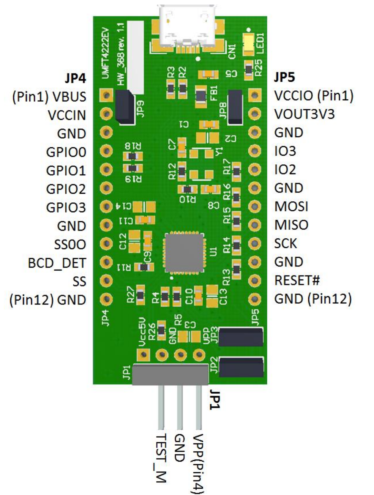

# FT4222 SPI communication with Gap9

This repository shows how to comunication between Gap9 and UMFT4222EV

## Physical Connection

The UMFT4222EV board can be powered at 1.8V removing J8 and connecting 

|UMFT4222EV| Gap9EVK  |
|----------|----------|
| JP5  |CN8 PIN 2|
|   |   |
|   |   |

Doc of UMFT4222EV can be found [here](https://ftdichip.com/wp-content/uploads/2020/07/DS_UMFT4222EV.pdf)

